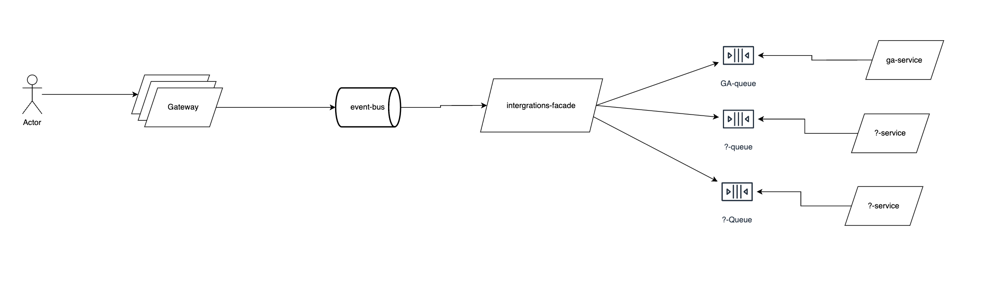
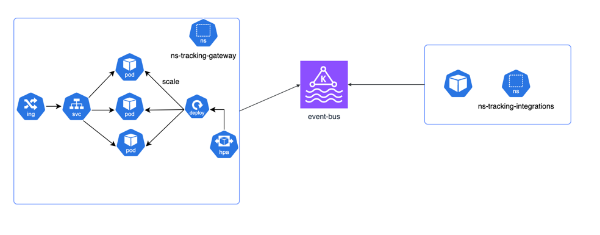

## Architecture overview:

As based on our needs, we do not want to wait for responses from the server and 
we just want to "fire-and-forget" tracking events - this app may ideally suit for
event-based architectures.

- User just fires events with Rest of Websocket from browser
- tracking-gateway microservice will only put events to event-bus
- tracking-integrations microservice will subscribe to new events. it may do next actions:
  - It may enrich events payload.
  - distribute events to another services
  - store events in internal db

As we can not control stability of any 3rd party service, we may want to add
message queue when we need to communicate with such third party services. This also
could also reduce the load on our servers as we could send events in batches and when required.
- per-integration service

## Implementation estimation

As I am a big fan of CI/CD and deploying often, I would go with setting up initial infra and CI/CD
before even writing some code.

- Set up infra using terraform ( Complexity 3 )
  - k8s
  - vpc
  - any other required resources
- Set up k8s cluster, tools: Argocd/Helm/External-Secrets ( Complexity 2 )
- Create repos, setup CI/CD, create initial helm charts for microservices ( Complexity 1 )
- Implement tracking-gateway microservice: Nest.js, typescript, Redis/Kafka ( Complexity 2 )
- Implement tracking-integrations microservice and connect to event-bus: Nest.js, typescript, Redis/Kafka ( Complexity 2 )
- Connect tracking-integrations to gtag ( Complexity 1 )
- Implement frontend sdk ( Complexity 2 )
- Test solution. Add e2e tests. ( Complexity 1 )

## Implementation details

Current implementation is a bit simplified and it doesn't introduce message queue per 3rd party integration burden.

In k8s world it may look like this

This solution doesn't implement part about user identification, but there are
3 mainly used technologies currently for that:
- fingerprinting user identities
- etags
- cookie based solutions

## Running the app

Instructions about how to run backend are in

[instructions](../backend/tracking-gateway/README.md)

Frontend could be still run as [usual](../README.md)

## Running app in k8s

Also this app has all required scripts to run it in local k8s that
is spinned up in kind
[IaaC](../infra)

It builds docker images, starts kind cluster and deploys helm charts
