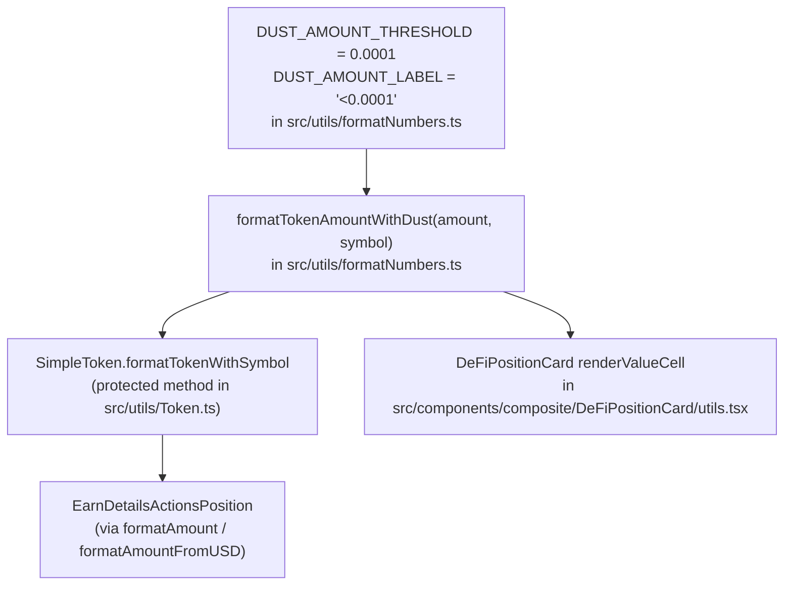

# Dust rendering

**Ticket**: [JUM-840](https://linear.app/lifi-linear/issue/JUM-840/display-dust-position-values-as-00001-instead-of-long-decimals)

## Decision

Token-amount strings rendered in position UIs collapse any non-zero value below `0.0001` to `<0.0001 SYMBOL`. The threshold and label live exactly once in `src/utils/formatNumbers.ts` and are reused by every call site.

## Why

Dust positions otherwise render as `0.000000000000000001 eETH`, which dominates the layout and is meaningless to users. `<0.0001` is the smallest representable amount that a user could reasonably act on.

## Implementation

## Boundary cases

| Input                           | Output                                                               |
| ------------------------------- | -------------------------------------------------------------------- |
| `amount > 0 && amount < 0.0001` | `<0.0001 SYMBOL`                                                     |
| `amount === 0`                  | `0 SYMBOL` — zero semantics preserved (`formatZeroAmount` unchanged) |
| `amount >= 0.0001`              | `amount SYMBOL` — unchanged                                          |
| Missing / empty symbol          | `---` fallback — unchanged                                           |

## Out of scope

`PositionCard` / `TokenAmount` already caps display via `useTokenFormatters.toDisplayAmount` (`maximumFractionDigits: 3`), so it never produces a long-decimal dust string. Leaving it untouched keeps this change minimal.
