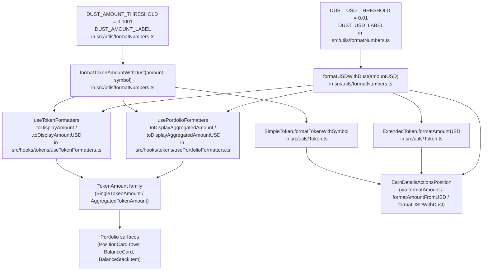

# Dust position rendering

**Ticket**: [JUM-840](https://linear.app/lifi-linear/issue/JUM-840/display-dust-position-values-as-00001-instead-of-long-decimals)

## Decision

Token-amount strings in position UIs collapse any non-zero value below `0.0001` to `<0.0001 SYMBOL`. USD values in the same surfaces collapse any non-zero value below `$0.01` to `<$0.01`.

Numeric thresholds (`DUST_AMOUNT_THRESHOLD`, `DUST_USD_THRESHOLD`) live in `src/utils/formatNumbers.ts`. The collapsed labels are locale-aware: they are read from `src/i18n/translations/<lng>/translation.json` under `format.dustAmount` / `format.dustUsd` via the `i18next` singleton, with an en-US literal fallback when i18next hasn't been initialised yet (e.g. unit tests or very early startup).

`@lifi/widget`'s `compactNumberFormatter` (Unicode subscript notation, e.g. `0.0₁₇1 eETH`) was evaluated and rejected: it reads as a rendering bug rather than intentional formatting.

## Why

Dust positions otherwise render as `0.000000000000000001 eETH` or `$0.000000000000001`, which dominate the layout and are meaningless to users.

On the "0.0001 BTC ≈ €6" denomination concern: the token threshold is intentionally denomination-blind. The USD column always sits next to it and collapses below `$0.01`, giving the user a non-misleading anchor to interpret the row. A price-aware threshold can be revisited in a follow-up.

## Implementation

### Where applied

| Surface                      | Entry point                                         | Routes through                                                                                                                                                       |
| ---------------------------- | --------------------------------------------------- | -------------------------------------------------------------------------------------------------------------------------------------------------------------------- |
| Portfolio DeFi positions tab | `PositionCard.renderValueCell` -> `TokenAmount`     | `useTokenFormatters` (single) / `usePortfolioFormatters` (aggregated)                                                                                                |
| Portfolio Tokens tab         | `BalanceCard` / `BalanceStackItem` -> `TokenAmount` | `useTokenFormatters` / `usePortfolioFormatters`                                                                                                                      |
| Earn "Your position" card    | `EarnDetailsActionsPosition`                        | `SimpleToken.formatAmount` -> `formatTokenAmountWithDust`; `ExtendedToken.formatAmountUSD` -> `formatUSDWithDust`; direct `formatUSDWithDust` in the USD-only branch |

The hooks inline the `numeric > 0 && numeric < THRESHOLD` predicate and delegate to the helpers only on the dust branch, so non-dust values keep their existing localized `format.decimal` / `format.currency` / `format.currencyCompact` formatting.

## Boundary cases

### Token amounts

| Input                           | Output                                                               |
| ------------------------------- | -------------------------------------------------------------------- |
| `amount > 0 && amount < 0.0001` | `<0.0001 SYMBOL`                                                     |
| `amount === 0`                  | `0 SYMBOL` — zero semantics preserved (`formatZeroAmount` unchanged) |
| `amount >= 0.0001`              | `amount SYMBOL` — unchanged                                          |
| Missing / empty symbol          | `---` fallback — unchanged                                           |

### USD amounts

| Input              | Output                             |
| ------------------ | ---------------------------------- |
| `0.001` (sub-cent) | `<$0.01`                           |
| `0`                | `$0.00` — zero semantics preserved |
| `0.01` (boundary)  | `$0.01` — unchanged                |
| `12.34`            | `$12.34` — unchanged               |

## Out of scope

The global `currencyFormatter` / `t('format.currency', ...)` path (NetworkCost, FeeBreakdownTooltip, etc.) is intentionally unchanged on its own. Collapsing applies to call sites that route through `useTokenFormatters` / `usePortfolioFormatters` (Portfolio surfaces via `TokenAmount`) and the Earn `Token.ts` methods. Other consumers of `t('format.currency')` keep their existing behavior.

The deprecated `src/components/composite/DeFiPositionCard/` folder was deleted as part of this change since the Portfolio Provider migration left it without production references.
